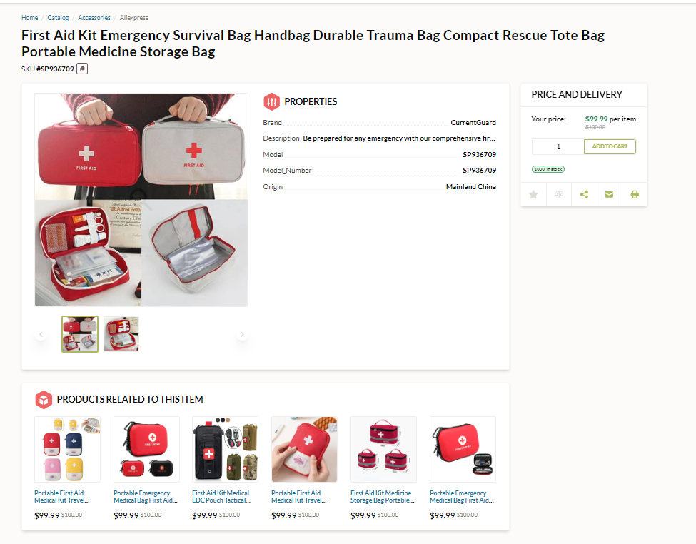
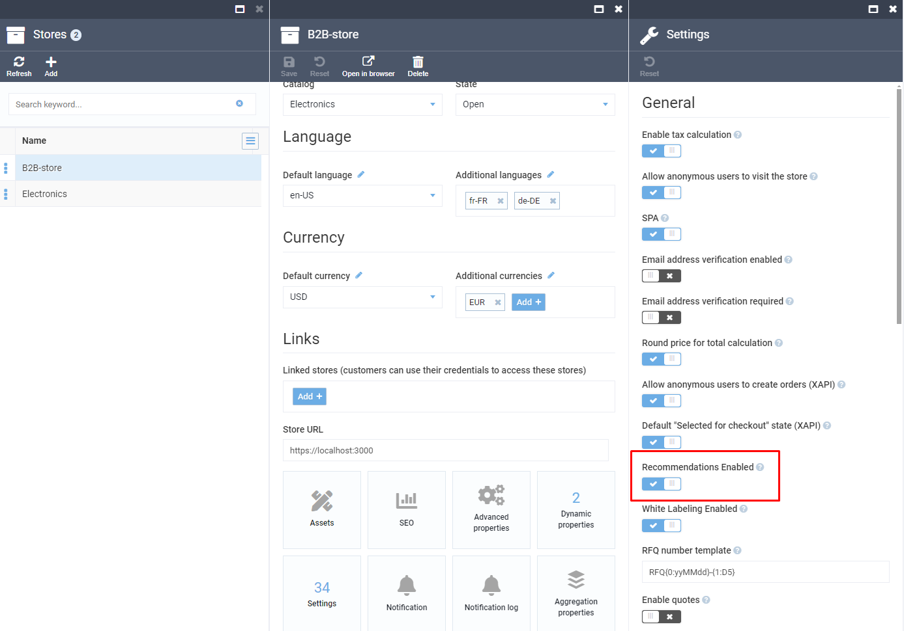

# Recommendations Module

Recommendations Module adds an extendable query to VirtoCommerce Platform that lets you display recommendations.

## Overview

Recommendations Module adds XAPI product recommendations query to VirtoCommerce Platform GraphQL schema. The API provides a list of recommended products based on semantic similarities in product names and other searchable properties. The module is designed to be plug-and-play, integrating seamlessly with back-end and front-end to enhance the user experience by offering intelligent product recommendations.






## Requirements

* [VirtoCommerce.Xapi](https://github.com/VirtoCommerce/vc-module-x-api) module version 3.800 or higher
* [VirtoCommerce.XCatalog](https://github.com/VirtoCommerce/vc-module-x-catalog) module version 3.800 or higher
* [VirtoCommerce.ElasticSearch8](https://github.com/VirtoCommerce/vc-module-elastic-search-8) module module version 3.805 or higher
* **Semantic Search and ELSER Model** should be set up for Elastic Search 8 module. See: [Semantic Search and ELSER Model Setup](https://github.com/VirtoCommerce/vc-module-elastic-search-8?tab=readme-ov-file#semantic-search-and-elser-model-setup)

## Features

* **Semantic Similarity**: Utilizes Elastic Search machine learning model to recommend products that are semantically similar to the given product. 
* **Customizable**: Parameters such as the number of recommendations can be easily adjusted.
* **Extendable**: You can extend the current `related-products` model or add your own custom recommendation algorithms.
* **Easy Integration**: Provides a toggle setting to your store setting to enable or disable recommendations on your front-end app.


## XAPI Specification

### Query

```js
query {
  recommendations(
    storeId:"Electronics"
    cultureName: "en-US"
    model: "related-products"
    productId: "Product-ID-12345"
    currencyCode: "USD"
    maxRecommendations: 5
  )
  {
    products   
    {
      id
      name
      code  
    }
  }
}
```

## License

Copyright (c) Virto Solutions LTD.  All rights reserved.

Licensed under the Virto Commerce Open Software License (the "License"); you
may not use this file except in compliance with the License. You may
obtain a copy of the License at

<https://virtocommerce.com/open-source-license>

Unless required by applicable law or agreed to in writing, software
distributed under the License is distributed on an "AS IS" BASIS,
WITHOUT WARRANTIES OR CONDITIONS OF ANY KIND, either express or
implied.
